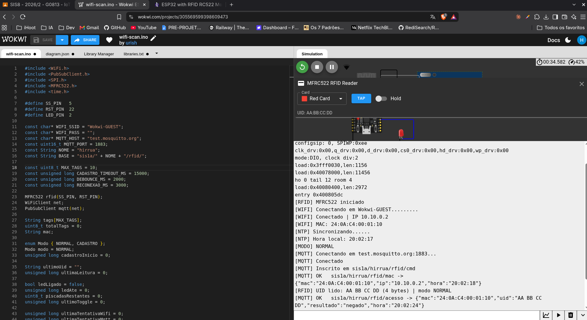
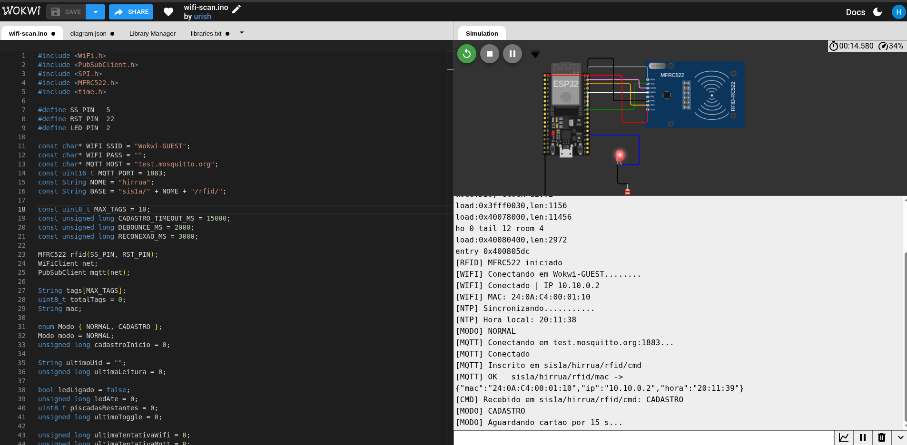
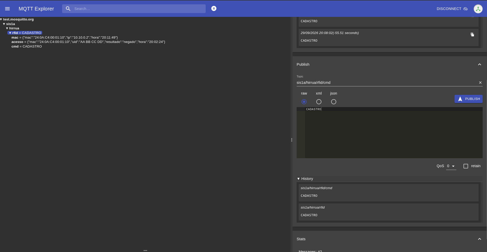
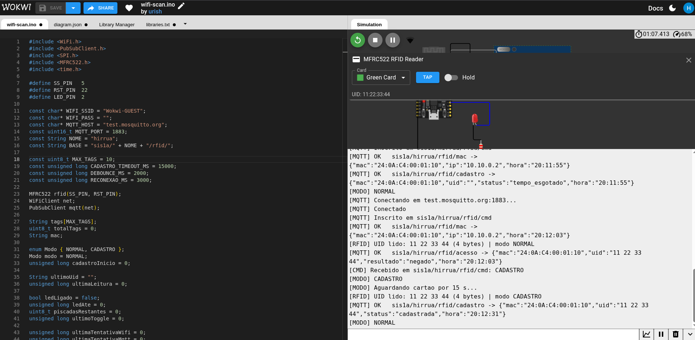
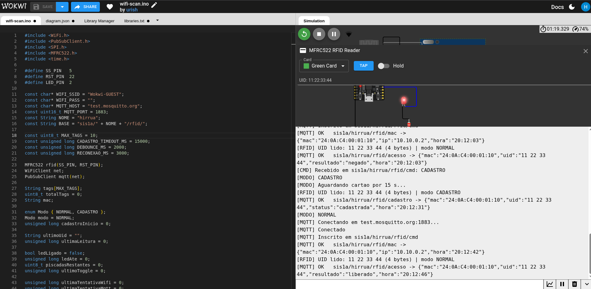
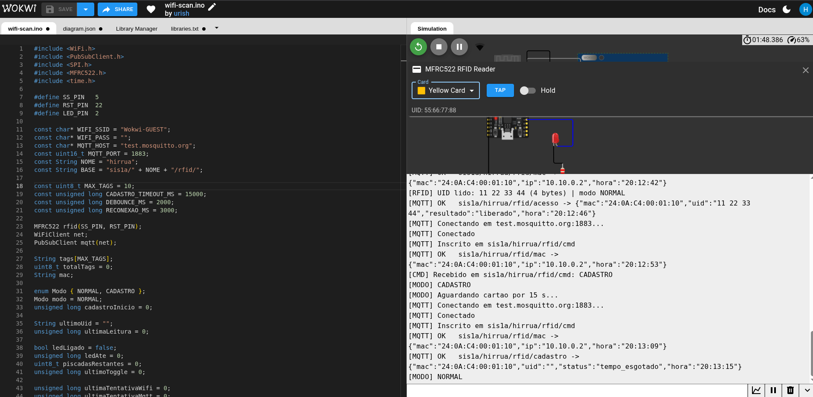
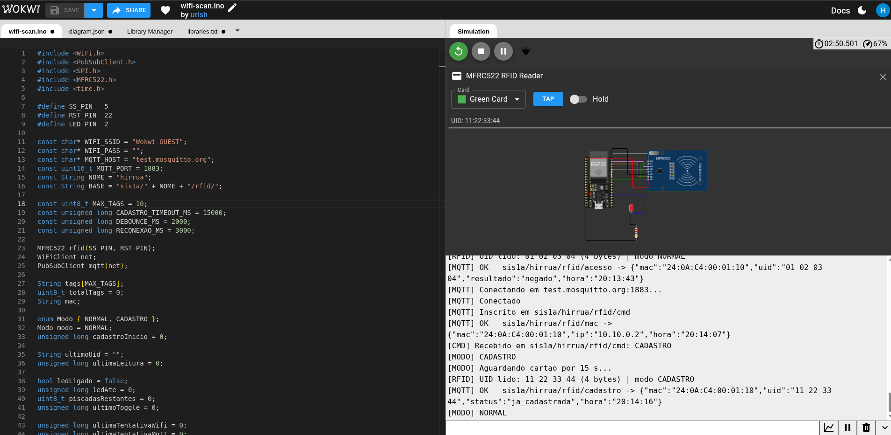
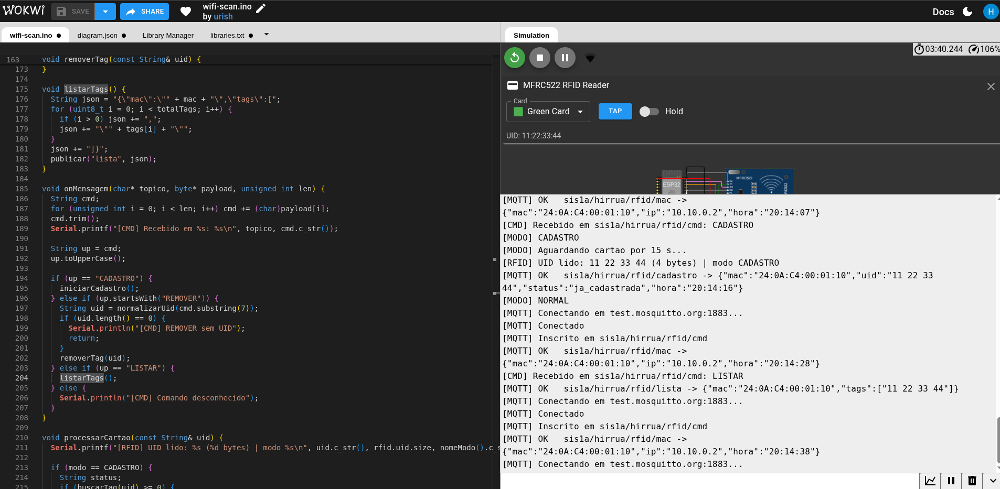
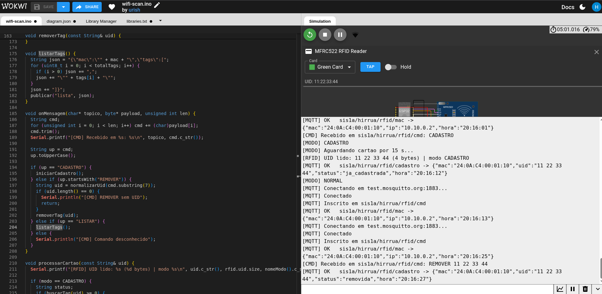

## Trabalho IOT (29/09/2026)

Link do Wokwi: https://wokwi.com/projects/476542478171839489

1. Acesso negado

2. Led piscando no cadastro

3. Publicando o comando no MQTT Explorer

4. Passando o Green card e cadastro

5. Cartão liberado

6. Limite excedido

7. Cartão já cadastrado

8. Listando os MAC cadastrados

9. Removendo o cartão
